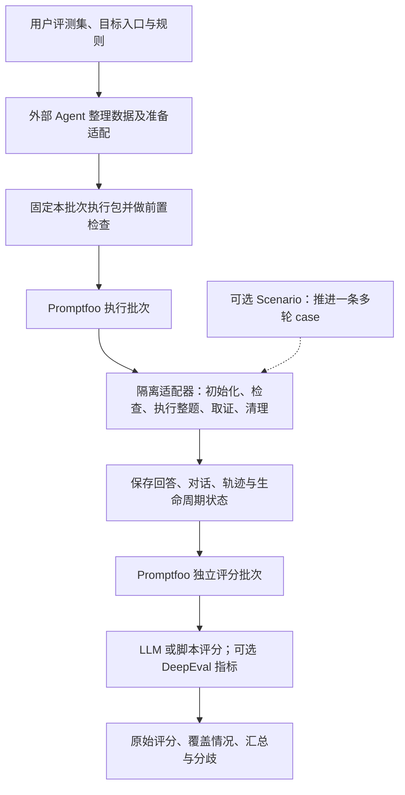

# 评测工具复用方案评估

评估日期：2026-09-23。状态：方案建议与局部技术验证，尚未实现产品。

本文以当前对话的「有限批次评测工具」为范围。仓库原有《产品定义》《技术选型建议》包含桌面应用、内置主 Agent 和持续调优等更大范围，本轮不以这些历史内容作为开发要求。

**建议：Promptfoo 作为唯一主要批量执行框架；我们补齐评测约定、隔离生命周期、产物关联和汇总口径；多轮模拟与专项指标按实际缺口引入独立模块。**

这条路线兼顾现成基础和各取所长。初期通过公开接口调用依赖，锁定版本，不维护大型源码分支。当前结论基于官方资料、接口检查和 Promptfoo 0.123.1 的内存模拟验证；还未验证真实业务系统与完整多轮链路。

**一、我们需要交付的能力**

下表区分当前需求与拟采用的实现。

| 需要的能力 | 已确认的产品含义 | 建议复用与补充 |
| --- | --- | --- |
| 交付评测集 | 接受用户已有文件；外部 Agent 负责理解、整理、发现歧义 | 使用现成文件解析能力，保存原始文件、行号/来源与规范化 case 的对应关系；工具只消费明确的执行数据 |
| 接入目标 | 模型、Agent、Workflow、Chatbot；远程 API、本地服务或本地命令 | Promptfoo 已有 HTTP、模型与脚本 provider；业务差异由适配器处理。已部署本地服务可按 HTTP 接入 |
| 接入评分模型 | API 配置可以提前提供，评分 Prompt 可以后配 | 模型连接配置与评分规则分开保存；同一连接可被不同角色引用 |
| 批量重复执行 | 每题执行 N 次；每次从独立起点开始 | 复用批次执行、并发和重复能力；我们定义 case、trial、补跑 attempt 的关联 |
| 会话及业务状态隔离 | 题内多轮保留上下文；跨题及跨次独立；必要业务状态恢复 | 我们定义初始化、状态检查、完整执行、取证和清理的适配协议；无法满足要求时阻止正式评测 |
| 多轮场景 | 固定多轮与动态模拟用户都支持；模拟目标、事实和约束来自 case | 先验证 Promptfoo 自带模拟能力；需要混合脚本、分支与更细控制时接 Scenario，一次调用负责整条 case |
| 评分 | 用户规则优先；支持 LLM、用户脚本和外部 Agent 生成脚本 | 基础 LLM 与程序评分复用 Promptfoo；专项指标可接 DeepEval |
| 多模型、多次评分 | 同一份执行结果可被多模型各评 M 次；保留原始分数和理由 | 使用独立评分批次；评分数据只引用保存的执行产物；我们实现明确的关联和汇总规则 |
| 失败及补跑 | 单题故障记录并继续；隔离、全局鉴权等问题暂停；可补跑失败项 | 复用框架已有执行机制，约束业务重试条件；保存完成单元与状态，不把补跑计入计划重复次数 |
| 外部 Agent 控制 | 外部 Agent 负责准备、生成适配/评分脚本和结果分析 | 先提供 CLI/程序接口；后续若需要 MCP，包装同一组操作 |

本轮不加入 GUI、内置主 Agent、自动修改被测对象或持续调优循环。

**二、为什么选择这条组合方式**

| 路线 | 适用性判断 | 主要成本 | 本轮结论 |
| --- | --- | --- | --- |
| 直接配置一个现成产品 | 普通问答、无状态 API 和常见评分已经能覆盖很多需求 | 我们要求的隔离失败处理、重评约束与统计语义仍有缺口 | 可以作为基础，不能直接宣称满足全部承诺 |
| 一个执行框架＋少量明确扩展 | 批次、并发、模型调用等基础能力集中；业务约定由我们控制 | 需要维护适配器与少量产品逻辑 | 最适合当前范围 |
| 多套完整框架并列或互相嵌套 | 能快速获得较宽的功能清单 | 会同时出现多套重试、缓存、会话、停止条件和结果语义 | 初版避免；只有局部模块确有价值时引入 |
| 自研批量执行与模型接入 | 自由度较高 | 大量重复实现通用能力，长期维护成本高 | 当前没有必要 |

选择 Promptfoo 的主要依据是现有接入方式与本次需求贴近：API、本地命令、程序评分、模型评分和无 GUI 调用可以利用其现成能力。[HTTP provider](https://www.promptfoo.dev/docs/providers/http/) · [命令 provider](https://www.promptfoo.dev/docs/providers/custom-script/) · [Node API](https://www.promptfoo.dev/docs/usage/node-package/)

核心执行路径建议如下：

同一个业务环境的整个执行生命周期必须串行或加锁；拥有独立环境的 case 才可以安全并发。负责批量调度的框架保持一个。Scenario 如果被引入，只负责题内对话推进；DeepEval 只负责具体指标计算。

**三、各项目用什么、借鉴什么**

| 项目 | 可以直接利用的能力 | 本轮采用方式与取舍 |
| --- | --- | --- |
| [Promptfoo](https://github.com/promptfoo/promptfoo) | provider 接入、批量运行、断言、输出导出、CLI/Node API | 主要执行框架。通过公开 provider/评分接口扩展；隔离失效与最终业务结论由我们明确约束 |
| [Scenario](https://github.com/langwatch/scenario) | 多轮用户模拟、脚本与场景控制、完整消息结果 | 可选多轮模块。直接调用 `run()` 完成一条 case；只有原生模拟能力不足时才增加这项依赖 |
| [DeepEval](https://github.com/confident-ai/deepeval) | G-Eval、RAG、对话等具体评分指标 | 按需调用指标的 `measure()` / `a_measure()`；不再引入第二套完整批量 runner |
| [Inspect AI](https://github.com/UKGovernmentBEIS/inspect_ai) | Python 任务、solver/scorer、日志、独立重评分、沙箱 | 借鉴任务/评分分层和日志语义；已有 Inspect 资产时可做导入。若未来以可控沙箱内长程 Agent 为主，可重新评估它作为唯一执行框架 |
| [Harbor](https://github.com/harbor-framework/harbor) | 任务环境、Agent trial、verifier、重复任务与容器化环境 | 受控环境和编码 Agent 基准的候选底座；当前通用业务 API 场景不需要默认嵌入其完整运行时 |

以上是针对本产品的取舍，不能理解为这些项目缺少其他功能。Inspect 支持远程 API 自定义任务；Harbor 也有用户模拟和重评分能力。[Inspect solver](https://inspect.aisi.org.uk/solvers.html) · [Harbor 用户模拟](https://docs.harborframework.com/core-concepts/jobs/simulate-a-user) · [Harbor 重评分](https://docs.harborframework.com/core-concepts/jobs/regrade)

Scenario 具有直接库调用接口，结果包含消息记录。它自带的 Judge/停止判断不能自动等同于我们的最终业务评分，需要保持两者角色清楚。[Scenario run](https://langwatch.ai/scenario/reference/javascript/scenario/functions/run.html) · [ScenarioResult](https://langwatch.ai/scenario/reference/javascript/scenario/interfaces/ScenarioResult.html)

DeepEval 可以单独测量一个测试对象，无需使用完整 runner。具体指标可能需要检索上下文、工具证据或对话记录，缺少这些输入时不能凭最终回答补造过程分数。[指标接口](https://deepeval.com/docs/metrics-introduction)

**四、真正需要我们维护的部分**

1. **统一执行包。** 固定规范化数据、源数据映射、目标适配、隔离方式、评分规则、脚本及版本、模型连接引用。密钥通过引用或运行环境提供，不写进分享产物。外部 Agent 可以准备和调整执行包，正式批次使用固定版本。
2. **业务隔离适配器。** 在实际调用目标的位置控制初始化、检查、整题执行、证据保存和清理。清理失败会使该环境进入「状态不可信」，暂停复用；独立环境可以继续。状态必须跨进程恢复保存。
3. **执行与评分的关联。** 至少能定位 case、trial、补跑 attempt、产物版本、评分规则版本、grader 和评分次数。重评分路径只具有读取产物和调用评分器的能力。
4. **统一结果口径。** 保存目标作答情况、生命周期错误、评分错误、证据不足和有效评分；不能只照搬框架的一个 success 字段。按事先确定的公式汇总，同时显示覆盖率与分歧。

这些部分是「组装」仍然需要承担的业务逻辑。模型 provider、通用断言、整套批次调度等现成功能继续复用。

Promptfoo 已有供外部 Agent 使用的官方 skills，因此「Agent 帮用户写配置」本身不能作为独有优势。[官方 Agent skills](https://www.promptfoo.dev/docs/integrations/agent-skill/)

**五、本地验证结果**

运行环境：Windows、PowerShell 7.6.5、Node.js 24.13.0、Promptfoo 0.123.1。依赖安装在临时目录；所有目标与 Judge 都是本地内存模拟，没有调用真实模型 API。缓存与遥测关闭，未使用托管平台。证据保存于 `output/reuse-evidence/`，该目录按仓库既有规则被 Git 忽略。

| 验证项 | 观察结果 | 可以支持的结论 |
| --- | --- | --- |
| 2 个 case，各执行 3 次 | 6 次目标调用，6 条结果，6 个不同会话标识 | 重复执行和逐次初始化入口可用；没有证明真实后端状态已经隔离 |
| 初始化钩子抛错 | 目标调用 0 次；整个 evaluate 抛错 | 在本次串行路径中可阻止初始调用；后续仍要测已完成结果的保留与恢复 |
| 清理钩子抛错 | 下一题仍被执行；两条结果均为 success=true | 原生 afterEach 无法直接承担我们要求的隔离失败阻断 |
| 6 份非空产物，2 个模拟 Judge，各评 3 次 | 36 次评分调用，0 次目标调用；18 行中保存 36 个评分分项 | 可以复用现有评分运行方式；还需独立验收归属、权重、缺失分母等语义 |
| 保存产物为 `providerOutput: ''` | 实际调用了目标 1 次 | 本版本不能直接依赖该字段保证所有重评路径都不重跑目标 |
| 使用只能读产物的 provider 处理空输出 | 0 次目标调用；保留空字符串并正常执行断言 | 公开扩展接口可绕开空值回退，重评与目标调用能够分离 |
| 在 provider 内模拟清理失败并阻止后续调用 | 串行场景中目标仅调用 1 次；后续记录环境阻断 | 无需改上游源码即可实现局部保护；完整并发锁、批次暂停和持久恢复尚未验证 |

原始记录：[probe-results.json](../output/reuse-evidence/probe-results.json)。验证脚本：[probe.mjs](../output/reuse-evidence/probe.mjs)、[probe-hooks.mjs](../output/reuse-evidence/probe-hooks.mjs)。详细执行与评分记录同目录保存，依赖版本由 package-lock.json 固定。

清理失败示例中的框架错误字段只用于观察行为。产品设计应分别保存「作答已完成」「回答内容」「清理失败」「环境暂停」，不能直接把已取得回答转成零分。

**六、与现有产品相比，我们的优势和代价**

| 方向 | 我们有机会做好的地方 | 代价及限制 |
| --- | --- | --- |
| 使用流程 | 围绕已有文件、现有目标和现有 Agent 完成一次评测，减少用户学习配置的负担 | 外部 Agent 可能理解错字段和业务含义，需要可检查的映射与试跑；现有产品也在降低接入门槛 |
| 实验起点 | 把会话、业务状态与清理失败纳入正式评测约定，让用户知道结果基于什么环境 | 通用 API 不一定暴露重置或取证能力；部分用户会被阻止正式运行，接入成本较高 |
| 结果解释 | 分开目标执行波动、Judge 分歧、执行错误与缺失证据，保留重评分依据 | 更复杂的状态和统计不能只靠一个平均数表达；实现及用户理解成本上升 |
| 复用 | 模型接入和评分指标可以跟随成熟项目演进 | 依赖升级仍需兼容验证；多接一个完整运行时就会增加维护成本 |
| 产品竞争 | 聚焦有状态业务系统的一次可复查批次，可能形成清晰的体验价值 | API 评测、重复执行、LLM Judge、脚本和 Agent skills 都已有实现；当前功能清单尚不能证明技术壁垒或市场需求 |

对于「普通无状态 API＋常规问答评分」，直接使用 Promptfoo/DeepEval 可能已经足够。我们最应该验证的增量价值是：有业务状态的系统能否更省心地接入、异常是否可解释、保存的结果是否便于可靠重评。

**七、还需要补入设计的遗漏**

以下是本轮提出的建议，不代表用户已经逐项确认。

| 优先级 | 问题 | 建议默认处理 |
| --- | --- | --- |
| P0 | 「保证隔离」的范围 | 明确会话、长期记忆、文件、数据库和账号等相关状态由谁隔离。新 session ID 或一次探测无泄漏，只能提供有限证据；缺少必要接入条件则阻止正式评测 |
| P0 | 并发与清理失败 | 共享环境锁住初始化至清理全过程；隔离环境可并发。清理失败标记状态不可信，禁止复用，恢复后仍须检查 |
| P0 | 超时后的业务状态 | 超时可能发生在业务动作完成之后。将计划重复与故障重试分开；写操作需幂等、状态查询或恢复起点后才能补跑 |
| P0 | 失败如何影响分母 | 执行失败、评分失败、证据不足分别记录。不得静默删去失败分数，也不得自动按零分处理；展示有效数/计划数，覆盖不足时不给完整批次验收结论 |
| P0 | 评分标准变动 | 除脚本外，同时固定评分 Prompt、模型标识/参数、生成的评分步骤、权重和缓存策略。变更后创建新评分版本，重评相关产物 |
| P0 | 重评误执行目标 | 评分配置只连接只读产物 provider；缺文件、损坏、空回答、执行失败分别处理，禁止缺失时回退目标 |
| P1 | Judge 是否可信 | 多模型和多次评分不会自动消除共同偏差。用少量人工判定的正例、反例、边界例检查评分器；保留理由、分歧、输入依据和规则版本 |
| P1 | 模拟用户跑偏 | 固定事实、目标、约束和模拟配置；记录停止原因。模拟器违背场景约束属于无效执行，应区别于目标失败；轮数封顶与自然结束分开 |
| P1 | 程序评分的运行环境 | 外部 Agent 生成脚本后先用明确样例验证，正式批次固定版本。脚本使用受控工作目录、超时和清晰输入输出；报错属于评分故障 |
| P1 | 证据够不够 | 回答文本只支持相应输出质量判断。验证实际退款、数据库修改或工具参数，需要明确对应证据；缺证据保留「无法判断」 |
| P1 | 调用量及恢复 | 预估目标执行数、评分数和模拟额外调用；分开并发限制，记录费用/时间并支持额度暂停；补跑先核对计划版本与已完成单元 |
| P1 | 评测集代表性 | 标注数据来源、重复项、场景覆盖和权重。小批次高分只能说明这组样本，不直接代表全部生产情况 |
| P1 | 评分器受答案干扰 | 将被评回答当作待评价数据；防止回答中的指令影响 Judge 或驱动评分 Agent 执行动作。评分脚本能获得的能力单独限定 |

关于用户未给出的评分细节，仍按先前约定允许 LLM Judge 做判断并解释依据。工具无需要求用户填写所有细则；但也不能把 Judge 自行补充的细节表述为用户已经指定的规则。缺少业务验收线时，可以输出分数、理由和局限，不直接宣布业务已达标。

**八、次数与汇总的明确口径**

以 300 个 case、各执行 3 次、2 个 Judge 各评分 3 次为例：

- 目标执行产物最多 900 份，每份对应一条完整 case；多轮 case 内包含多次交互。
- 基础评分计划为 5,400 次。模拟用户、评分步骤生成、某些指标内部子调用及失败重试可能带来更多 API 请求。
- 同一产物先计算每个 Judge 自己的有效评分均值，再按固定模型权重合并；之后按 case 的执行次数和 case 权重汇总。
- 某模型评分缺失时不能悄悄改变模型权重；显示覆盖与缺失，是否允许不完整估计由规则明确决定。
- 先统一分值范围与高低含义；不同语义的指标分别报告，只有规则明确时再合成一个总分。
- 同一份答案的多次评分属于 Judge 重复测量，不应被算成更多独立 case。分别展示目标表现波动与 Judge 分歧。
- 纯确定性脚本对同一固定产物重复运行通常不会增加信息，建议默认一次；用户仍可按需求配置重复。

每条评分保存：产物 ID/校验值、case、trial、Judge、评分次数、规则版本、有效状态、分数、理由和必要证据引用。已有回答、空回答、缺失产物和运行错误使用不同状态表示。

即便记录模型名称、配置和时间，如果服务商提供的是浮动模型别名，也无法保证远端实现完全固定；报告需保留这一重放限制。缓存应在正式重复实验中禁用或明确隔离，并用调用计数验证没有重复读旧结果。

**九、下一步实现顺序及换底座条件**

建议先交付一个可以完整验收的小闭环，围绕公开扩展接口完成：

1. 一个无状态目标、一个带会话和可重置业务状态的目标；验证执行、证据与失败处理。
2. 固定多轮和动态多轮各一个场景；验收题内连续、跨次独立、正确停止和异常后部分对话留存。
3. 固定产物上的多模型、多次评分；验证空回答、缺失产物、Judge 错误、权重、分母与版本变化。
4. 中途退出和恢复、共享环境串行、独立环境并发、写操作超时后的补跑。
5. 用有代表性的真实用户任务比较「直接用现有产品」与「经过我们工具」的接入步骤、人工干预和结果可解释性。

多轮支持属于已确认需求，初版验收必须覆盖；Scenario 是否作为依赖，由原生能力验证决定。DeepEval 指标按实际需求接入。初版不预建同时运行多个底座的通用插件平台。

如果关键语义需要频繁修改 Promptfoo 内核、依赖未公开内部函数，或者大部分任务已转为受控沙箱中的长程 Agent，应重新评估 Inspect/Harbor 作为唯一主要执行框架。当前模拟验证尚未出现必须这样切换的证据。

局部验证已说明方案可以通过公开接口推进；真实后端隔离、多轮模拟、持久恢复、完整并发及最终统计仍属于后续验收内容。
